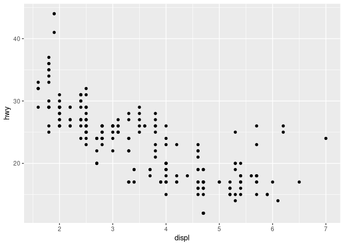

Aprendiendo GGplot2
================

## Librerias

``` r
library(tidyverse)
```

    ## ── Attaching packages ─────────────────────────────────────── tidyverse 1.3.1 ──

    ## ✓ ggplot2 3.3.5     ✓ purrr   0.3.4
    ## ✓ tibble  3.1.4     ✓ dplyr   1.0.7
    ## ✓ tidyr   1.1.3     ✓ stringr 1.4.0
    ## ✓ readr   2.0.1     ✓ forcats 0.5.1

    ## ── Conflicts ────────────────────────────────────────── tidyverse_conflicts() ──
    ## x dplyr::filter() masks stats::filter()
    ## x dplyr::lag()    masks stats::lag()

``` r
library(devtools)
```

    ## Loading required package: usethis

``` r
library(usethis)
```

## Correr Siempre

``` r
#usethis::use_git(message = "V1")
```

## leyendo Dtos

``` r
# View(mpg) #leyendo datos
attach(mpg)
# str(mpg)
```

## Scatter plot

[figuras](https://www.dropbox.com/s/h18nmf5vahdidzs/figuras.Rmd?dl=0)

``` r
d <- ggplot(mpg, aes(displ,hwy)) # PASO 1
(d + geom_point())
```

<!-- -->

``` r
# gitcreds::gitcreds_set()
```

``` r
# gh::gh_whoami()
```
